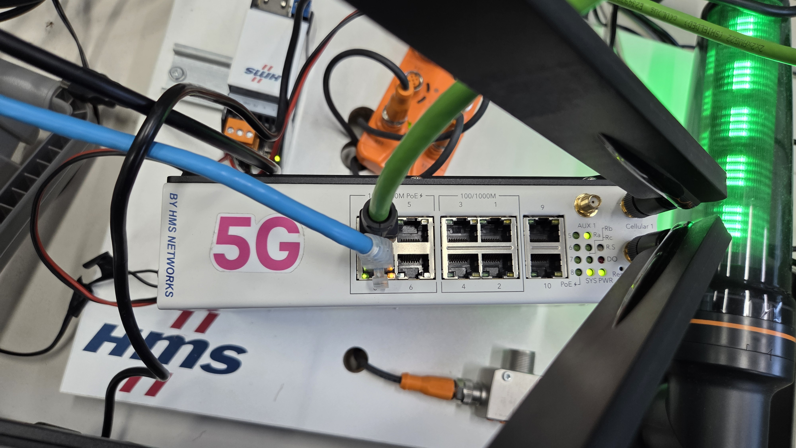
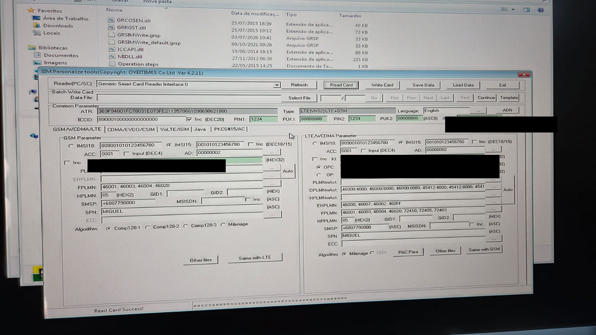
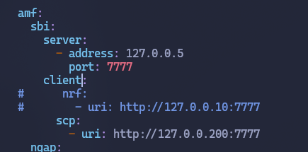
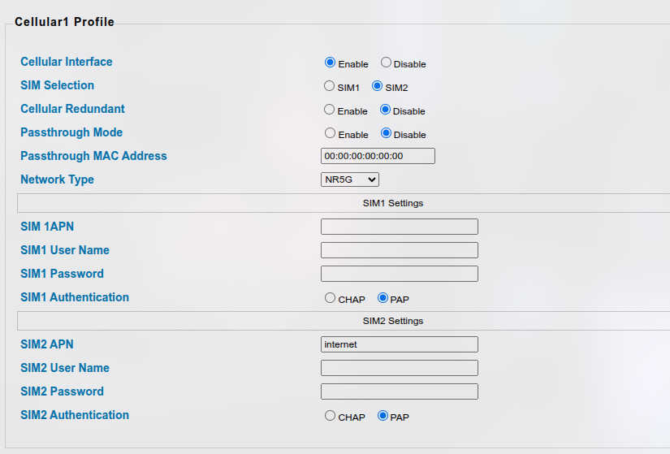
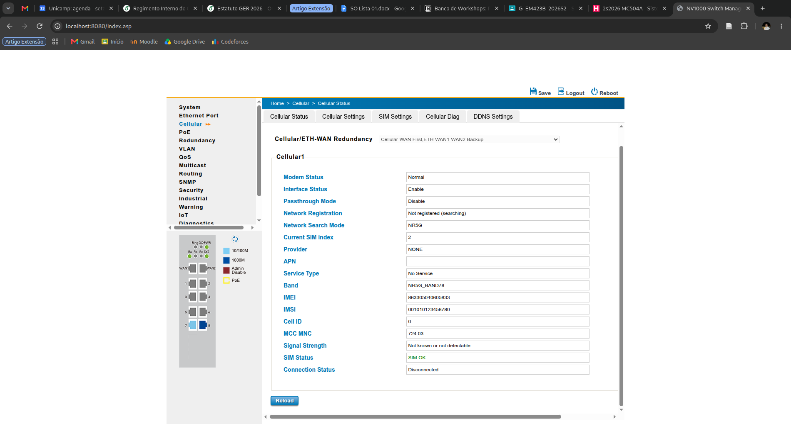
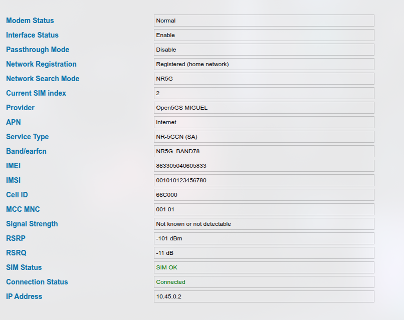
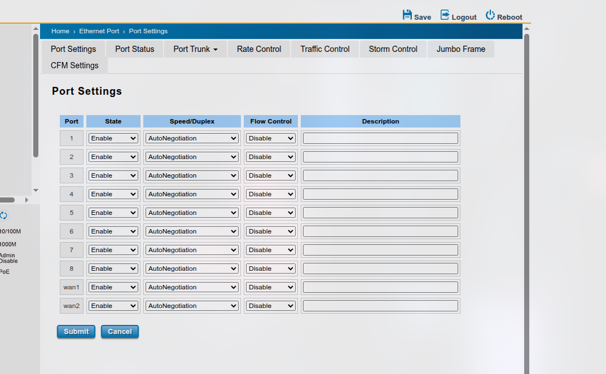
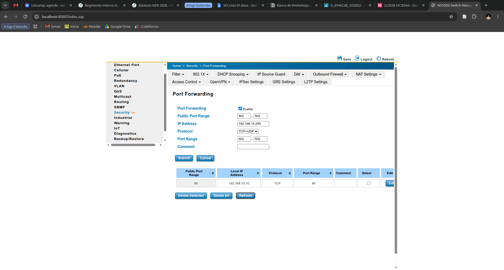
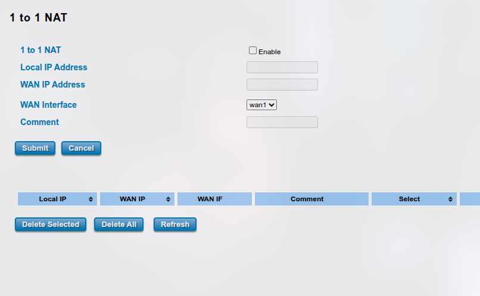
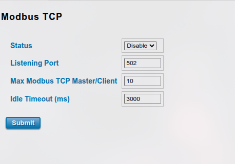

# Tutorial: bench sobre 5G privada (HMS router + Open5GS + gNB USRP)

Passo a passo de como subimos a rede 5G standalone usada pra rodar o bench
do sensor Modbus (hub IFM) sobre 5G em vez de Ethernet — core Open5GS, gNB
OCUDU/srsRAN numa USRP B200/NI-2901, e um roteador industrial HMS Networks
fazendo o papel de UE.

Esse setup é físico/real, diferente do `5g-slicing/` deste repo (que é
UERANSIM simulado em loopback). Aqui a RF é de verdade.

```
hub IFM (Modbus TCP) ──Ethernet──> roteador HMS "5G" (UE)
                                        │ RF (n78, 20 MHz)
                                        ▼
                                  gNB OCUDU/srsRAN (USRP B200/NI-2901)
                                        │ N2 (NGAP) / N3 (GTP-U)
                                        ▼
                                  Open5GS core (AMF/SMF/UPF/...)
                                        │
                                        ▼
                                  bench.py (mede latência)
```

## 0. Hardware/software envolvidos

- **gNB**: OCUDU (srsRAN_Project) rodando numa USRP B200 / NI USRP-2901
  (mesma placa RF, driver UHD `type=b200`)
- **UE**: roteador industrial HMS Networks com modem 5G embutido + switch
  de 8 portas + Cellular1/Aux1 (foto abaixo), acessível via web em
  `http://192.168.10.1` (túnel SSH até lá, ver seção 5)
- **Core**: Open5GS instalado nativo via systemd (não Docker) no host
  `5G-Node-01`
- **Sensor**: hub IFM IO-Link, Modbus TCP, ligado na porta LAN do roteador



## 1. SIM

Gravação feita com o **SIM Personalize Tool** (OYEITIMES Co.,Ltd) — software
chinês que vem junto com o cartão de teste (não é ferramenta genérica,
é específico do fabricante do SIM), rodando num Windows 7 ligado a um
leitor de smartcard PC/SC:



> KI, OPC e ADM foram borrados na imagem antes de entrar no repo — são as
> chaves de autenticação/administração reais da SIM, não fazem sentido
> versionadas em texto claro mesmo num repo privado de laboratório.

Campos usados:

- **IMSI**: `001010123456780` (mcc `001` + mnc `01` + MSIN)
- **PLMN**: `00101`
- **Algoritmo**: Milenage (não Comp128)
- **Ki** e **OPC**: gerados na gravação — anota os valores em local seguro,
  eles não entram neste documento nem em nenhum arquivo versionado. São
  esses mesmos valores que vão pro subscriber no Open5GS (seção 2).

> PLMN `001/01` é a faixa reservada pra "Test Network" (ITU). Nesta sessão
> funcionou normalmente assim que o resto da config bateu — não precisou
> trocar pra outro PLMN.

## 2. Core Open5GS

Arquivos em `/etc/open5gs/*.yaml`, no host do core.

### 2.1 `amf.yaml` — bloco `ngap` (o que faltava)

O erro `N2: Failed to connect to AMF on [127.0.0.5]:38412. error="Connection
refused"` era porque o `amf.yaml` não tinha bloco `ngap` nenhum — o AMF
nunca abria a porta NGAP. Sintoma: `sudo ss -ltnp | grep 38412` vazio.

```yaml
amf:
  sbi:
    server:
      - address: 127.0.0.5
        port: 7777
    client:
      # nrf:
      #   - uri: http://127.0.0.10:7777
      scp:
        - uri: http://127.0.0.200:7777

  ngap:
    server:
      - address: 127.0.0.5      # mesmo IP que vai em amfConfigs.address da gNB

  guami:
    - plmn_id:
        mcc: 001
        mnc: 01
      amf_id:
        region: 2
        set: 1

  tai:
    - plmn_id:
        mcc: 001
        mnc: 01
      tac: 1                    # TEM que bater com o tac da gNB (seção 3)

  plmn_support:
    - plmn_id:
        mcc: 001
        mnc: 01
      s_nssai:
        - sst: 1
```



### 2.2 Por que `client.nrf` tá comentado

Essa instalação usa **SCP** (Service Communication Proxy) em vez de cada NF
falar direto com o NRF:

- NRF de verdade escuta em `127.0.0.10:7777` (`nrf.yaml`)
- SCP escuta em `127.0.0.200:7777` (`scp.yaml`) e faz proxy pro NRF
- **Todo** NF (`amf`, `ausf`, `bsf`, `nssf`, `pcf`, `sepp`, `smf`, `udm`,
  `udr`) tem `client.nrf.uri` comentado e `client.scp.uri` apontando pro
  `.200` — é o padrão indireto do Open5GS, não é config quebrada. Não mexe
  nisso, só confere que todo mundo aponta pro mesmo `.200`:

```bash
grep -r "127.0.0.10\|127.0.0.200" /etc/open5gs/*.yaml
```

### 2.3 Cadastro do subscriber (WebUI)

Porta padrão `9999`. Se a WebUI nativa (`systemctl status open5gs-webui`)
e uma tentativa via Docker brigarem pela mesma porta, mantém só uma —
nesta sessão a nativa (`open5gs-webui.service`) já tava rodando, então o
`docker compose up 5gc` foi abandonado.

Cadastra:
- IMSI: `001010123456780`
- Ki / OPC: os valores gerados na gravação da SIM (seção 1)
- Algoritmo: Milenage
- Slice: `sst: 1`
- DNN/APN: `internet` (mesmo nome usado no roteador, seção 5)

## 3. gNB (OCUDU/srsRAN, USRP B200/NI-2901)

Config validada, banda **n78** (3.5 GHz), **20 MHz**:

```yaml
cu_cp:
  amf:
    addr: 127.0.0.5
    port: 38412
    bind_addr: 127.0.0.1
    supported_tracking_areas:
      - tac: 1                    # bate com tai.tac do amf.yaml
        plmn_list:
          - plmn: "00101"
            tai_slice_support_list:
              - sst: 1

ru_sdr:
  device_driver: uhd
  device_args: type=b200          # NI-2901 usa o mesmo driver b200
  srate: 23.04
  tx_gain: 75
  rx_gain: 75
  otw_format: sc16
  clock_source: internal
  sync_source: internal

cell_cfg:
  dl_arfcn: 632628                # ~3489.42 MHz
  band: 78
  channel_bandwidth_MHz: 20
  common_scs: 30
  plmn: "00101"
  tac: 1                          # bate com cu_cp.amf.supported_tracking_areas
  pci: 1
  nof_antennas_dl: 1
  nof_antennas_ul: 1

log:
  filename: /tmp/gnb.log
  all_level: warning

pcap:
  mac_enable: false
  ngap_enable: false
```

**`tac` tem que ser idêntico nos três lugares**: `cell_cfg.tac`,
`cu_cp.amf.supported_tracking_areas[].tac` (na gNB) e `amf.tai.tac` (no
core). Divergência aqui deu dois erros diferentes:

- `tac` da gNB ≠ `tai.tac` do AMF → NG Setup rejeitado, causa NGAP
  `unknown-PLMN-or-SNPN`
- `cell_cfg.tac` ≠ `cu_cp.amf.supported_tracking_areas[].tac` **dentro do
  mesmo YAML da gNB** → `Could not find cell PLMN '00101' and cell TAC '1'
  in the CU-CP supported tracking areas list` / `Invalid configuration
  detected`

Se o UHD não achar a NI-2901 sozinho com `type=b200`, acha o serial com
`uhd_usrp_probe` e usa `device_args: type=b200,serial=<serial>`.

### USB3 obrigatório

Log real visto rodando em USB2 (ou cabo/porta não negociando USB3):

```
[WARNING] [MULTI_USRP] The total sum of rates (23.040000 MSps on 1 channels)
exceeds the maximum capacity of the connection. This can cause underruns (U).
```

`23.04 MSps` (20 MHz) não cabe em USB2 (~480 Mbps). Checa:

```bash
lsusb -t | grep -A2 -i usrp
dmesg | grep -i "usb 3\|SuperSpeed\|xhci" | tail -20
```

Se não aparecer `5000M`/`10000M` (USB3), troca cabo/porta (nunca hub) ou
cai pra `channel_bandwidth_MHz: 10` (~11.52 MSps, cabe em USB2).

## 4. Confirmando a gNB de pé

```
Cell pci=1, bw=20 MHz, 1T1R, dl_arfcn=632628 (n78), dl_freq=3489.42 MHz,
dl_ssb_arfcn=632256, ul_freq=3489.42 MHz
```

Sem warning de USB, sem erro de N2 — gNB de pé, esperando a UE.

## 5. Roteador HMS (UE)

Acesso à interface web (`192.168.10.1`) via túnel SSH, saltando pelo
gateway do laboratório:

```bash
ssh -N -L 8080:192.168.10.1:80 lrc_gateway
```

abre `http://localhost:8080`.

### 5.1 Cellular Settings — APN

`Cellular` → `Cellular Settings`. APN do SIM em uso (SIM2 nesta sessão)
tem que bater com o DNN cadastrado no core (seção 2.3):



### 5.2 Cellular Status — antes/depois

Antes de bater o `tac`, a UE ficava presa em busca, achando um PLMN
comercial (`724 03`, TIM) em vez do PLMN de teste — sintoma de que o
`Network Search Mode`/scan automático não tinha nada certo pra achar
enquanto a gNB rejeitava o NG Setup:



Depois do fix de `tac` (seção 3), conectou de primeira:



- Registration: `Registered (home network)`
- Service Type: `NR-5GCN (SA)`
- MCC MNC: `001 01`
- RSRP `-101 dBm` / RSRQ `-11 dB` — fraco mas funcional. Pra teste sério de
  throughput/latência, aproxima a antena da gNB ou sobe `tx_gain`/`rx_gain`.
- IP atribuído pela SMF: `10.45.0.2` (varia entre reconexões — confere
  sempre antes de rodar o bench)

### 5.3 Mapa de portas Ethernet — isolamento do bench

`Ethernet Port` → `Port Settings`. Portas `1`–`8` são LAN/switch, `wan1` e
`wan2` são WAN de backup (`Cellular/ETH-WAN Redundancy: Cellular-WAN
First, ETH-WAN1-WAN2 Backup`):



O cabo do hub IFM entra numa porta LAN (`1`–`8`), não numa `wan1`/`wan2` —
isso é só gerência/dados locais, não interfere no teste 5G. Se alguma
`ETH-WANx` estiver conectada à rede do laboratório com saída própria, o
roteador pode cair pra Ethernet como backup sem avisar, contaminando a
comparação Ethernet vs. 5G do bench — desativa/desconecta enquanto testa.

## 6. Expor o hub Modbus através do 5G — **TODO / em investigação**

Objetivo: um cliente do lado do core (ex. `5G-Node-01`, que roda a UPF)
precisa alcançar `192.168.10.250:502` (o hub) **através** do roteador —
não direto pela LAN do laboratório, senão o teste não mede o caminho 5G.

Confirmado nesta sessão: com `ping 10.45.0.x` funcionando (a UE responde
normal), uma conexão TCP na porta 502 não retornava nada.

### 6.1 Tentativa 1 — Port Forwarding (falhou)

`Security` → `NAT Settings` → `Port Forwarding`: porta pública `502` →
`192.168.10.250:502`, TCP+UDP.



Regra salva e sobrevive a reboot, mas a conexão simplesmente não volta
resposta nenhuma (nem RST). Diagnóstico feito com `tcpdump -i ogstun` no
lado do core confirmou: o SYN sai e chega, nunca volta nada.

**Causa raiz identificada**: o hub IFM responde normal quando testado
*dentro* da própria subnet (`192.168.10.0/24`, ex. a partir do
`lrc_gateway`), mas não tem rota de volta pra um IP de fora dela (o roteador
faz DNAT puro, sem mascarar a origem — o hub vê o pacote vindo de um IP
tipo `10.45.0.x`, fora da subnet dele, e não sabe como responder por falta
de gateway configurado nele).

Testado também: outra regra de port-forward pré-existente (porta 80 →
`192.168.10.10`) devolveu `No route to host` — erro ativo, diferente do
silêncio da porta 502. Isso confirma que o **mecanismo de forwarding
funciona** na WAN celular; o problema é específico do hub não conseguir
responder pra fora da subnet dele.

### 6.2 Tentativa 2 — 1 to 1 NAT (não concluída)

`Security` → `NAT Settings` → `1 to 1 NAT` — mesmo mecanismo de DNAT,
com seletor de `WAN Interface` (`wan1` por padrão, confirmar se
`Cellular1` aparece como opção). Provável mesmo problema da 6.1, não
testado até o fim.



### 6.3 Tentativa 3 (mais promissora) — Modbus TCP Gateway nativo

`Industrial` → `Modbus TCP`. Esse roteador é da HMS Networks (fabricante
de gateway industrial) e tem um gateway Modbus TCP embutido — ele termina
a conexão TCP ele mesmo em vez de só encaminhar pacote, então evita o
problema de roteamento assimétrico da 6.1/6.2.



Campos vistos: `Status` (Disable/Enable), `Listening Port` (502), `Max
Modbus TCP Master/Client` (10), `Idle Timeout (ms)` (3000).

**Falta resolver**: esse formulário não mostra onde configurar o
IP/porta do hub de *destino* — só a porta de escuta. Provavelmente existe
outra aba/página dentro de `Industrial` (mapeamento Modbus, lista de
I/O, serial port) que define o alvo. **Próximo passo**: explorar o menu
`Industrial` em busca dessa página de mapeamento, habilitar o gateway
(`Status: Enable`) só depois de achar onde apontar pro hub, e então
desativar o Port Forwarding manual da seção 6.1 (as duas regras
competiriam pela porta 502).

## 7. Rodando o bench

Depois que a seção 6 estiver resolvida:

```bash
make bench HOST=<IP da UE em Cellular Status> PORT=502 LABEL=5g
make plot
```

Confere antes de cada run:

- IP atual da UE (`Cellular Status`, muda entre reconexões)
- Isolamento de rota, se o bench roda num host que também tem acesso
  direto à LAN do laboratório:

```bash
ip route get 192.168.10.250   # ou o IP usado, checa que sai pela rota certa
```

## 8. Troubleshooting — resumo rápido

| Sintoma | Causa | Fix |
|---|---|---|
| `N2: Failed to connect to AMF ... Connection refused` | `amf.yaml` sem bloco `ngap` | Adiciona `ngap.server[].address` (seção 2.1) |
| `NG Setup ... unknown-PLMN-or-SNPN` | `tac` da gNB ≠ `tai.tac` do AMF | Iguala os dois (seção 3) |
| `Could not find cell PLMN ... TAC ... Invalid configuration` | `cell_cfg.tac` ≠ `cu_cp.amf.supported_tracking_areas[].tac` (mesmo YAML da gNB) | Iguala os dois campos na própria config da gNB |
| `[MULTI_USRP] ... exceeds the maximum capacity` (U/O) | B200/NI-2901 em USB2 em vez de USB3 | Troca cabo/porta USB3, ou reduz bandwidth pra 10 MHz |
| UE presa em "Not registered (searching)", `MCC MNC` mostrando rede comercial | Nenhum PLMN de teste disponível pra registrar (gNB ainda rejeitando NG Setup) | Resolve os dois itens de `tac` acima primeiro |
| `nc` na porta 502 não retorna nada (via 5G) mas hub responde local | Hub sem gateway configurado, DNAT não mascara origem | Seção 6 — ainda em aberto, ver Modbus TCP Gateway nativo |
| `docker compose up 5gc` → `address already in use` porta 9999 | WebUI nativa (`open5gs-webui.service`) já rodando na mesma porta | Usa só uma das duas (nesta sessão: manteve a nativa) |
